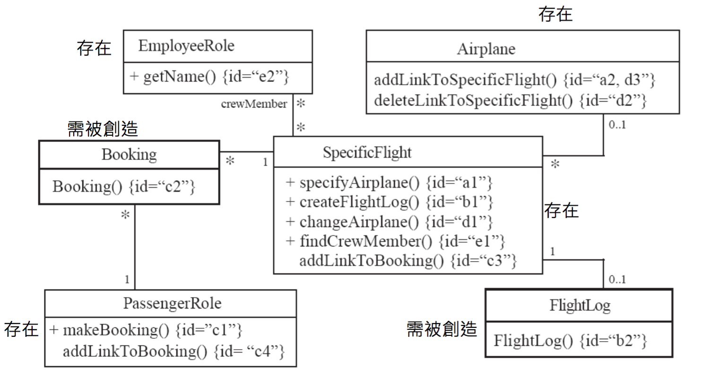

###An example of implementing class diagram

這裡以航空公司的系統作為範例, 系統中會紀錄航空公司裡面所有的資料(包括員工、乘客訂票資料)。 一般來說，一間航空公司(Airplane)裡會有好幾架飛機(SpecificFlight), 而一架飛機上又會有好幾個空服員(EmployeeRole)、 乘客(PassengerRole)及屬於該架飛機的log檔(FlightLog)。此系統的簡易類別圖如下。

在此範例中, 類別與類別之間的關係，可以分成**單純的結合關係**及**需要結合類別的結合關係**。

單純的結合關係還可以分成:  
(1)是和原本就**存在的實體物件**結合之間的關係，例如: 範例中的SpecificFlight與Airplane、SpecificFlight與EmployeeRole。SpecificFlight、Airplane、EmployeeRole都是存在的實體物件。 
(2)和原本**不存在的實體物件**結合之間的關係。屬於(2)這類的關係，需要產生該物件之後，才能做結合，例如SpecificFlight與FlightLog，需要由SpecificFlight來產生FlightLog物件。

而**需要結合類別的結合關係**，是因為原本需要結合關係的兩個類別，是沒有直接關係，需要加上結合類別，才能建立起關聯性，例如: 乘客(PassengerRole)預訂某一班飛機(SpecificFlight)，但是，乘客和飛機沒有直接的關係，是因為預訂這個動作才建立起關聯，所以需要預訂(Booking)這個結合類別。而結合類別都是需要被產生的(原本不存在的實體物件)。以剛剛例子來說的話，是由PassengerRole(做預訂makeBooking)來產生Booking物件的。

有個需要注意的地方是，需要被別人產生物件的類別，它們的建構式都必須是non-public的。

 
UML class diagram ：

